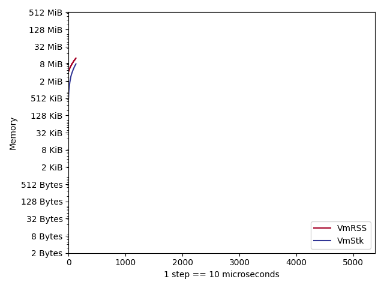

# stackoverflow-go

A small project helping to investigate stack overflow and out-of-memory errors in Go and Cgo.

## Steps to reproduce

Run investigation:
```bash
make investigation
(...)
./script.sh: line 5:     7 Killed                  ./stackoverflow-go -test.run=StackOverflowGo
./script.sh: line 6:    20 Segmentation fault      (core dumped) ./stackoverflow-go -test.run=StackOverflowCgo
```
After that look at kernel logs:
```
journalctl -k | grep stackoverflow
Jul 13 11:45:20 rt.pln.pls.rix.lv.rdmz.retn.net kernel: stackoverflow-g invoked oom-killer: gfp_mask=0xcc0(GFP_KERNEL), order=0, oom_score_adj=0
Jul 13 11:45:20 rt.pln.pls.rix.lv.rdmz.retn.net kernel: CPU: 1 PID: 72423 Comm: stackoverflow-g Not tainted 5.18.7-200.fc36.x86_64 #1
Jul 13 11:45:20 rt.pln.pls.rix.lv.rdmz.retn.net kernel: [  72184]     0 72184   669223    65551  1593344    64989             0 stackoverflow-g
Jul 13 11:45:20 rt.pln.pls.rix.lv.rdmz.retn.net kernel: oom-kill:constraint=CONSTRAINT_MEMCG,nodemask=(null),cpuset=docker-b1d583ef4ec7a04cda0c0e9a6804d0934bf00d88b84141570cf8251e808f1905.scope,mems_allowed=0,oom_memcg=/system.slice/docker-b1d583ef4ec7a04cda0c0e9a6804d0934bf00d88b84141570cf8251e808f1905.scope,task_memcg=/system.slice/docker-b1d583ef4ec7a04cda0c0e9a6804d0934bf00d88b84141570cf8251e808f1905.scope,task=stackoverflow-g,pid=72184,uid=0
Jul 13 11:45:20 rt.pln.pls.rix.lv.rdmz.retn.net kernel: Memory cgroup out of memory: Killed process 72184 (stackoverflow-g) total-vm:2676892kB, anon-rss:259204kB, file-rss:3000kB, shmem-rss:0kB, UID:0 pgtables:1556kB oom_score_adj:0
```

After that, have a look at `/tmp/stackoverflow-go` of your host machine.

## Results

### Go

Endless recursion in Go results in a heap growth. Process finally gets killed by OOM Killer as it reaches RSS Limit (`256m`) set for the Docker container.


### Cgo

Endless recursion in Cgo (and C) causes stack overflow error and segmentation fault since it reaches Linux stack size limit, which is `8Mb` by default (refer to `ulimit -a`).


